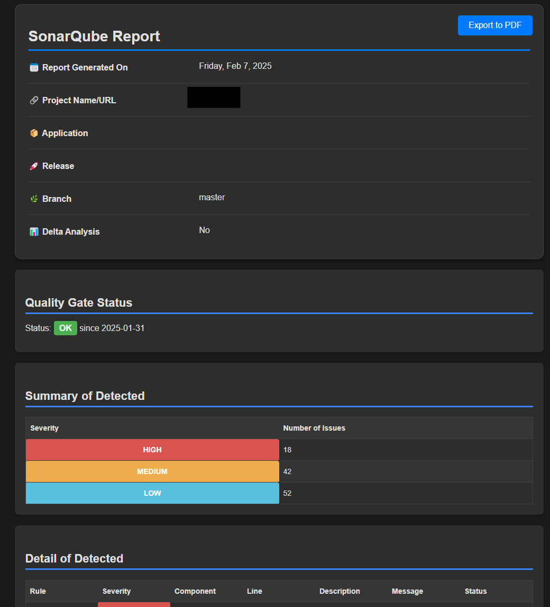
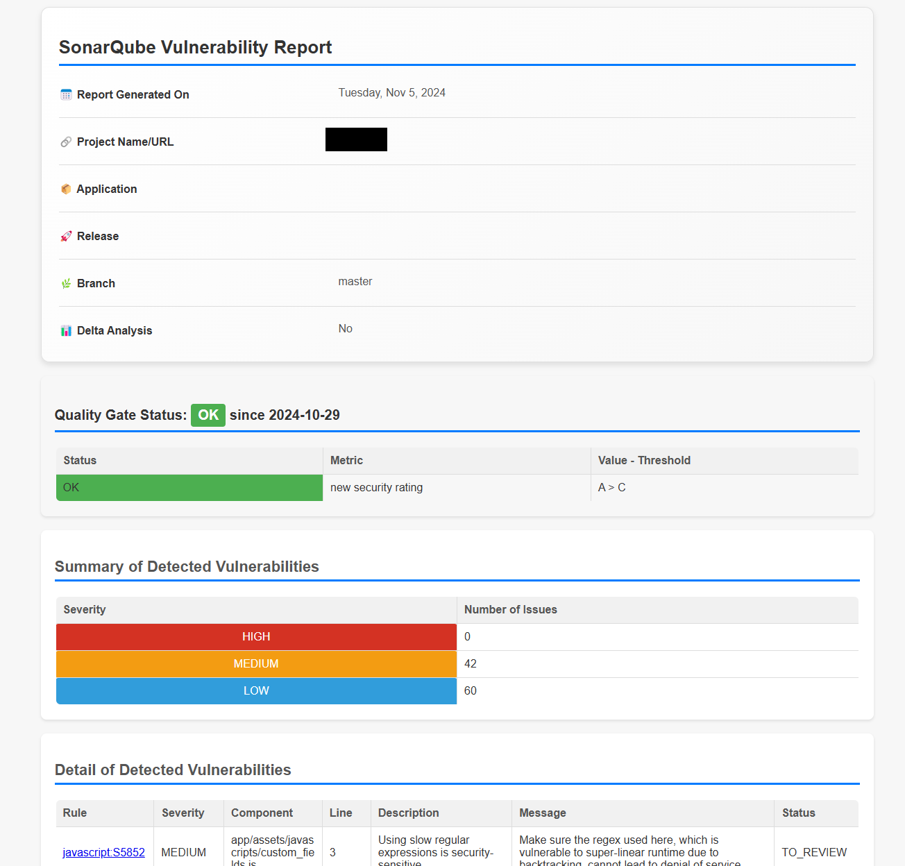

# 📊 SonarHawk

> An enhanced fork of [sonar-report](https://github.com/soprasteria/sonar-report) that provides modern vulnerability reporting for SonarQube.


<p align="center">
  <br/>
  <em>Enhanced vulnerability reporting with modern UI and advanced features</em>
</p>

## Key Features Over sonar-report

| Feature           | sonar-report | SonarFlex  |
| ----------------- | ------------ | ---------- |
| SonarQube Support | ≤ 7.9        | Up to 10.x |
| PDF Export        | ❌           | ✅         |
| Modern UI         | Basic        | Enhanced   |
| Quality Gates     | Basic        | Detailed   |
| Issue Tracking    | Basic        | Enhanced   |
| Hotspot Support   | Limited      | Full       |
| Delta Analysis    | Limited      | Full       |
| Debug Mode        | ❌           | ✅         |
| Proxy Support     | Basic        | Advanced   |
| Custom Templates  | Basic        | Full EJS   |
| Dark Theme        | ❌           | ✅         |

## Quick Start

```bash
# Installation
npm install -g sonarflex

# Basic Usage
sonarflex \
  --sonarurl="https://sonar.company.com" \
  --sonarcomponent="project-key" \
  --sonartoken="your-token" \
  --output="report.html"
```

## 📖 Documentation

### Essential Configuration

```bash
# Authentication (Token - Recommended)
sonarflex --sonartoken="your-token"

# Authentication (Username/Password)
sonarflex --sonarusername="user" --sonarpassword="pass"

# Branch Analysis
sonarflex --branch="feature/new-auth"

# Quality Gates
sonarflex --quality-gate-status --coverage
```

### Report Customization

```bash
# Custom Template
sonarflex --ejs-file="template.ejs"

# Custom Styling
sonarflex --stylesheet-file="custom.css"

# Custom Labels
sonarflex \
  --vulnerability-phrase="Security Issue" \
  --vulnerability-plural-phrase="Security Issues"
```

### Theme Options

Use the dark theme:

```bash
sonarflex --sonarurl=http://your.sonar.instance --sonarcomponent=your:project:key --output=report.html --dark-theme
```

## 🔧 Configuration Options

### Required Options

| Option             | Description   | Default |
| ------------------ | ------------- | ------- |
| `--sonarurl`       | SonarQube URL | -       |
| `--sonarcomponent` | Project key   | -       |
| `--sonartoken`     | Auth token    | -       |
| `--output`         | Report path   | -       |

### Analysis Options

| Option                  | Description       | Default |
| ----------------------- | ----------------- | ------- |
| `--branch`              | Branch to analyze | main    |
| `--in-new-code-period`  | Delta analysis    | false   |
| `--allbugs`             | Include all bugs  | false   |
| `--no-security-hotspot` | Disable hotspots  | false   |

### Visualization Options

| Option                  | Description        | Default |
| ----------------------- | ------------------ | ------- |
| `--quality-gate-status` | Show quality gates | false   |
| `--coverage`            | Show coverage      | false   |
| `--link-issues`         | Link to SonarQube  | false   |
| `--no-rules-in-report`  | Hide rules section | false   |
| `--dark-theme`          | Enable dark theme  | false   |

## 🛠️ Advanced Features

### Delta Analysis

Track changes between versions:

```bash
sonarflex \
  --in-new-code-period \
  --branch="feature/new-auth"
```

### Quality Gate Status

Include detailed quality metrics:

```bash
sonarflex \
  --quality-gate-status \
  --coverage
```

### Custom Report Styling

```bash
sonarflex \
  --stylesheet-file="custom.css" \
  --ejs-file="template.ejs"
```

## 🎨 Themes & Visual Customization

SonarFlex comes with built-in support for both light and dark themes, designed to optimize readability and reduce eye strain.

### Available Themes

#### 🌞 Light Theme (Default)

- Clean, professional appearance
- White background (#f7f7f7) with dark text (#333)
- High contrast for readability
- Optimal for printing
- Ideal for daytime use



#### 🌙 Dark Theme

- Modern dark mode interface
- Dark background (#1a1a1a) with light text (#e0e0e0)
- Reduced eye strain for low-light environments
- Enhanced link visibility with light blue accents
- Automatically switches to light theme when printing


### Using Themes

Enable dark theme via command line:

```bash
sonarflex --dark-theme [other options...]
```

Or in your configuration file:

```json
{
  "theme": "dark"
}
```

### Theme Features

Both themes include:

- Consistent color schemes
- Clear visual hierarchy
- Responsive design
- High contrast severity indicators
- Accessible link colors
- Print-friendly formatting

### Custom Styling

Want to customize the look further? Use your own CSS:

```bash
sonarflex --stylesheet-file="path/to/custom.css"
```

## 🔍 Debugging

Enable detailed logging:

```bash
sonarflex --debug
```

Debug output includes:

- API requests/responses
- Authentication process
- Template rendering
- File operations

## 🤝 Contributing

1. Fork the repository
2. Create feature branch (`git checkout -b feature/AmazingFeature`)
3. Commit changes (`git commit -m 'Add AmazingFeature'`)
4. Push to branch (`git push origin feature/AmazingFeature`)
5. Open Pull Request

## 📄 License

MIT License - see [LICENSE](LICENSE) for details

## 🙏 Acknowledgments

- Original [sonar-report](https://github.com/soprasteria/sonar-report) team
- [SonarQube](https://www.sonarqube.org/) team for their excellent API
- Community contributors and users

---

<p align="center">Made with ❤️ by the SonarFlex Team</p>
